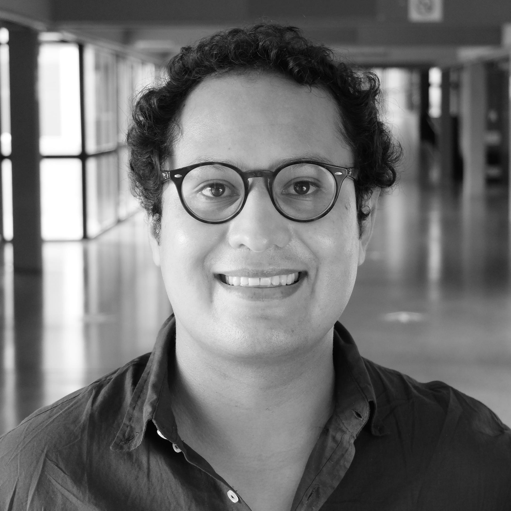

    Hello! I am a Visiting Professor in the Department of Statistics at the <a href="https://www.uc3m.es/departamento-estadistica/inicio">Universidad Carlos III de Madrid.</a> I hold a Ph.D in Economics (2023) from the University of Barcelona. Prior to this, I worked as a Senior Financial Analyst at the <a href="https://www.bcb.gob.bo">Central Bank of Bolivia (BCB)</a> and as an Economist at the <a href="https://www.cemla.org/index.html">Center for Latin American Monetary Studies (CEMLA)</a>.
    

    My fields of interests are topics related to macro-finance, forecasting, and time series, with special focus on forecasting risks in economics and finance.

- <a href="/assets/CV_061122 (1).pdf">CV here!</a>

    
    

