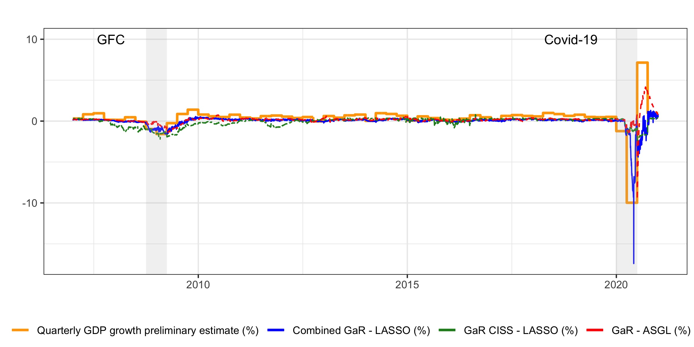
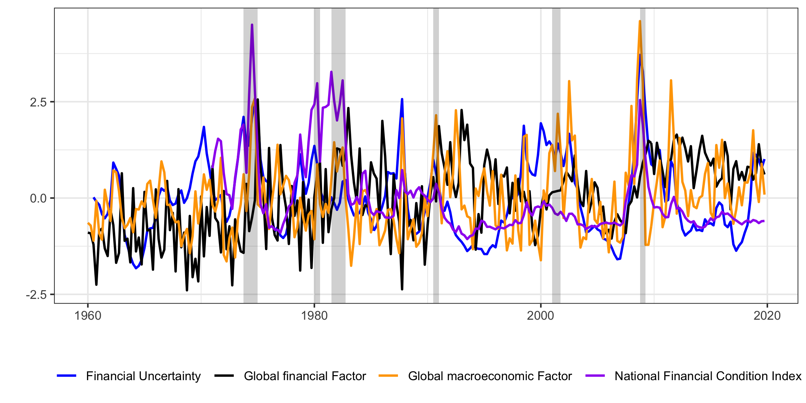
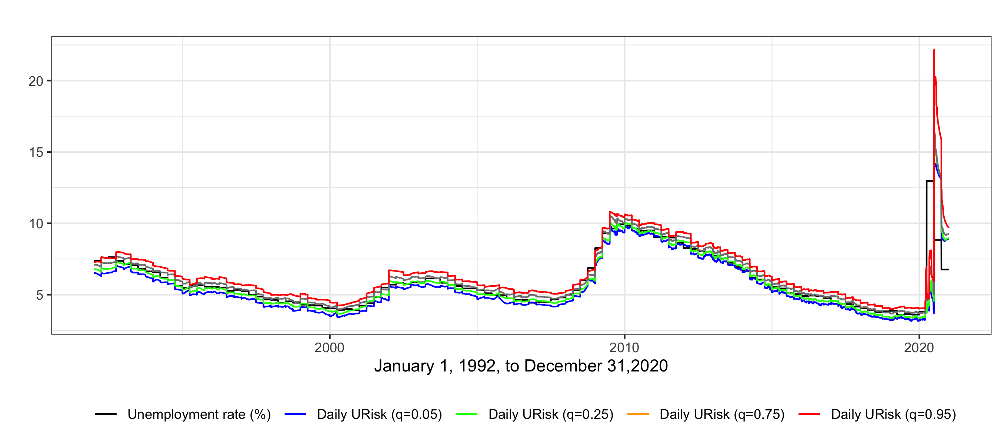

Recent publications (more in my [Google Scholar profile](https://scholar.google.es/citations?hl=es&user=nW7GW-kAAAAJ)):

**PhD work in progress**

#1. Daily Growth at Risk: financial or real drivers? The answer is not always the same (with H. Chuliá and J.M. Uribe). **Job Market Paper.** **R&R International Journal of Forecasting**. 
Presented at the  29th Finance Forum (Santiago de Compostela, Spain), UBRisk (Universitat de Barcelona, Spain).

    
#2. Vulnerable Funding in the Global Economy (with H. Chuliá and J.M. Uribe). **R&R Journal of Banking and Finance**.
Presented at the EEA-ESEM 2021 and the 27th German Finance Association.

#3. Monitoring Daily Unemployment at Risk (with H. Chuliá and J.M. Uribe). **Submitted Applied Economics Letters.**
Presented at the 42nd International Symposium on Forecasting, University of Oxford.

#4. Forecasting inflation at risk: via Phillips or data-driven approach?

    
    
